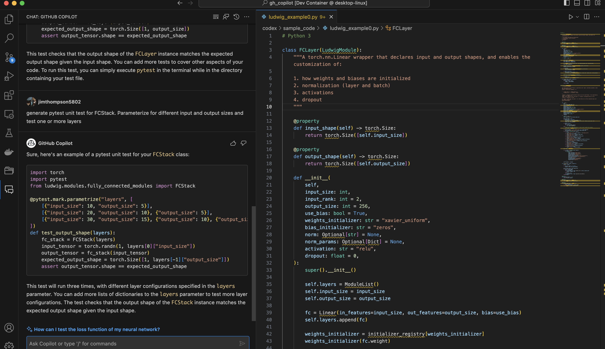

# Using Codex API

Example code for using Codex API

## Documentation:
* [Codex model](https://beta.openai.com/docs/models/codex)
* [Codex User Guide](https://beta.openai.com/docs/guides/code/code-completion-limited-beta)
* [Codex API documentation](https://beta.openai.com/docs/api-reference/code-completion)

## Contents
| File                 | Description                                                                                                   |
|----------------------|---------------------------------------------------------------------------------------------------------------|
| codex_api_example.py | Demonstrate invoking the Codex api to generate code from a prompt                                             |
| create_unit_test.py  | For all source modules in a specified directory, generate unit test and save in a specified output directory. |
| ludwig_unit_test_generation_results.md | Results of generating unit tests for Ludwig code using Codex API.                                             |
| translate_sas_to_python.py | Translate SAS code to Python code using Codex API.                                                            |

## Setup
`Dockerfile` in directory `docker` contains the setup for running the example code.  Run `build_image.sh` to create docker image and run example code in the container.  `run_codex.sh` starts a docker container with openai environment.


## Unit test example with Copilot X Chat Feature

Unit test for this Module: https://github.com/jimthompson5802/gh_copilot/blob/main/codex/sample_code/ludwig_example0.py



### Prompt
```
generate pytest unit test for FCStack. Parameterize for different input and output sizes and test one or more layers
```

### Generated code 1st Draft
```python
import torch
import pytest
from ludwig.modules.fully_connected_modules import FCStack

@pytest.mark.parametrize("layers", [
    [{"input_size": 10, "output_size": 5}],
    [{"input_size": 20, "output_size": 10}, {"output_size": 5}],
    [{"input_size": 30, "output_size": 15}, {"output_size": 10}, {"output_size": 5}]
])
def test_output_shape(layers):
    fc_stack = FCStack(layers)
    input_tensor = torch.randn(1, layers[0]["input_size"])
    output_tensor = fc_stack(input_tensor)
    expected_output_shape = torch.Size([1, layers[-1]["output_size"]])
    assert output_tensor.shape == expected_output_shape
```

### Modified code to run
A small change to the generated code is needed to run the unit test.  The first layer input size is not included in the layers list.  The first layer input size is needed to create the first layer of the FCStack.  The modified code is shown below.

```python
import torch
import pytest
from ludwig.modules.fully_connected_modules import FCStack

@pytest.mark.parametrize("layers", [
    [{"input_size": 10, "output_size": 5}],
    [{"input_size": 20, "output_size": 10}, {"output_size": 5}],
    [{"input_size": 30, "output_size": 15}, {"output_size": 10}, {"output_size": 5}]
])
def test_output_shape(layers):
    fc_stack = FCStack(first_layer_input_size=layers[0]["input_size"], layers=layers) # <== modified
    input_tensor = torch.randn(1, layers[0]["input_size"])
    output_tensor = fc_stack(input_tensor)
    expected_output_shape = torch.Size([1, layers[-1]["output_size"]])
    assert output_tensor.shape == expected_output_shape
```
