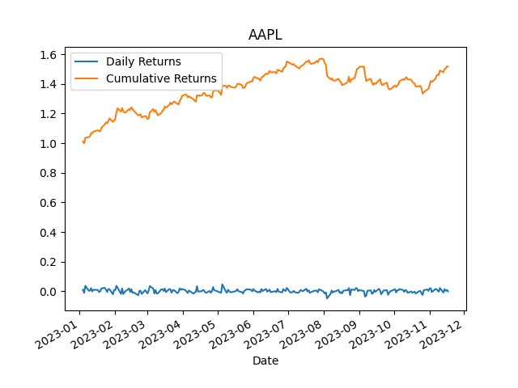

# Capital Markets

Following describes the code generated by for Capital Markets use cases.

## Extract stock data from Yahoo Finance and calculate daily and cumulative returns
GitHub Copilot: This Python script is used to fetch stock data for a specific company within a specified date range, calculate daily and cumulative returns, and visualize the results.

The script begins by importing necessary libraries: `yfinance` for downloading historical market data from Yahoo Finance, `datetime` for working with dates and times, `pandas` for data manipulation and analysis, and `matplotlib.pyplot` for data visualization.

The start and end dates for the data to be fetched are defined using the `datetime` function. The ticker symbol for the company of interest is specified as "AAPL" for Apple Inc., but this can be replaced with any valid ticker symbol.

The `yf.download` function is used to fetch the stock data for the specified company and period. The fetched data is a DataFrame that includes several columns such as Open, High, Low, Close, Adjusted Close, and Volume.

The script then extracts the closing prices from the fetched data and prints them. The closing price is the final price at which the stock trades during the regular trading session.

Next, the script calculates the daily returns, which represent the percentage change in the closing price from one day to the next. The cumulative returns, which represent the cumulative product of the daily returns, are also calculated. These calculations are done using the `pct_change` and `cumprod` functions, respectively.

The closing prices, daily returns, and cumulative returns are then combined into a single DataFrame using the `pd.concat` function. The columns of this DataFrame are renamed for clarity.

Finally, the script plots the daily and cumulative returns using the `plot` function from `matplotlib.pyplot`. The plot is saved as a PNG image in a specified directory and is also displayed on the screen using the `show` function.

## Sample Plot

