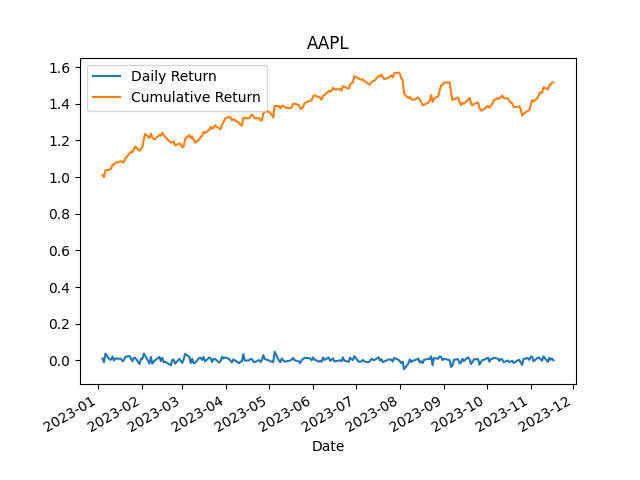

# Capital Markets

Following describes the code generated by for Capital Markets use cases.

## extract_stock_prices_copilot_chat.py (generated with GH Copilot and Copilot Chat)

Chat prompts:
``` 
Python code to retrieve stock price for AAPL from 1/1/2023 to 11/18/2023. print the closing prices. Compute daily and cumulative returns. Combine into closing prices and the returns into a single dataframe and print it.
```

``` 
plot the daily and cumulative returns and save as png image
```


``` 
Get the last closing price and compute the one year black scholes call and put option for a strike prices of $185 with a risk free rate of 0.02 and compute the volatility from the retrieved stock data.
```

GitHub Copilot: This Python script does the following:

1. Imports necessary libraries for data fetching, data manipulation, plotting, and mathematical operations.

2. Defines the start and end dates for which the stock data will be fetched.

3. Specifies the ticker symbol for the company whose stock data will be fetched. In this case, it's "AAPL" for Apple Inc.

4. Fetches the stock data for the specified company and period using the `yfinance` library.

5. Extracts the closing prices from the fetched stock data.

6. Computes the daily returns, which is the percentage change in closing prices from the previous day.

7. Computes the cumulative returns, which is the cumulative product of the daily returns.

8. Combines the closing prices, daily returns, and cumulative returns into a single DataFrame.

9. Renames the columns of the DataFrame for clarity.

10. Plots the daily and cumulative returns and saves the plot as a PNG image.

11. Defines the parameters for the Black-Scholes formula, which is used to calculate the price of call and put options. The parameters include the last closing price, strike price, risk-free rate, time to expiration, and volatility. The volatility is computed from the daily returns.

12. Prints the parameters for the Black-Scholes formula.

13. Calculates the price of the call and put options using the Black-Scholes formula.

14. Prints the prices of the call and put options.


## Sample Plot


## extract_stock_prices_copilot_only.py (generated with GH Copilot only via source comments and coding)
GitHub Copilot: This Python script does the following:

1. Imports necessary libraries for data fetching, data manipulation, plotting, and mathematical operations.

2. Defines the start and end dates for which the stock data will be fetched.

3. Specifies the ticker symbol for the company whose stock data will be fetched. In this case, it's "AAPL" for Apple Inc.

4. Fetches the stock data for the specified company and period using the `yfinance` library.

5. Extracts the closing prices from the fetched stock data.

6. Computes the daily returns, which is the percentage change in closing prices from the previous day.

7. Computes the cumulative returns, which is the cumulative product of the daily returns.

8. Combines the closing prices, daily returns, and cumulative returns into a single DataFrame.

9. Renames the columns of the DataFrame for clarity.

10. Plots the daily and cumulative returns and saves the plot as a PNG image.

11. Defines the parameters for the Black-Scholes formula, which is used to calculate the price of call and put options. The parameters include the last closing price, strike price, time to expiration, risk-free rate, and volatility. The volatility is computed from the daily returns.

12. Defines two functions, `black_scholes_call` and `black_scholes_put`, to compute the Black-Scholes call and put option prices for a European option.

13. Prints the parameters for the Black-Scholes formula.

14. Computes the call and put option prices using the defined functions.

15. Prints the prices of the call and put options.

## Sample Plot


## Observations
While the generated code is similar, there are differences in the volitiaty and put option calculations that require an knowledgeable perons to resolve.

## Volatility computation:
### Copilot Chat version
```python
# Compute the volatility
volatility = combined_df['Daily Returns'].std()
```

### Copilot only version
```python
sigma = daily_returns.std() * np.sqrt(252)
```

## Put option computation:
### Copilot Chat version
```python
def black_scholes_put(S, K, T, r, sigma):
    d1 = (math.log(S / K) + (r + 0.5 * sigma ** 2) * T) / (sigma * math.sqrt(T))
    d2 = d1 - sigma * math.sqrt(T)
    return K * math.exp(-r * T) - S * norm.cdf(-d1) + S * norm.cdf(-d2)
```

### Copilot only version
```python
def black_scholes_put(S, K, T, r, sigma):
    """Computes the Black-Scholes put option price for a European option."""
    d1 = (np.log(S / K) + (r + sigma ** 2 / 2) * T) / (sigma * np.sqrt(T))
    d2 = d1 - sigma * np.sqrt(T)
    return K * np.exp(-r * T) * norm.cdf(-d2) - S * norm.cdf(-d1)
```

## Differences in the Call/Put option computations
### Copilot Chat version
```
Stock Price: 189.69000244140625
Strike Price: 185
Time to Maturity: 1
Risk-Free Rate: 0.02
Volatility: 0.01302553541567368
Call Option: 8.353415062945686
Put Option: 181.33925484864466
```

### Copilot only version
```
Last closing price: 189.69000244140625
Strike price: 185
Risk-free rate: 0.02
Time to expiration: 1
Volatility: 0.2067739644200214
The call option price is $19.81
The put option price is $11.46
```


