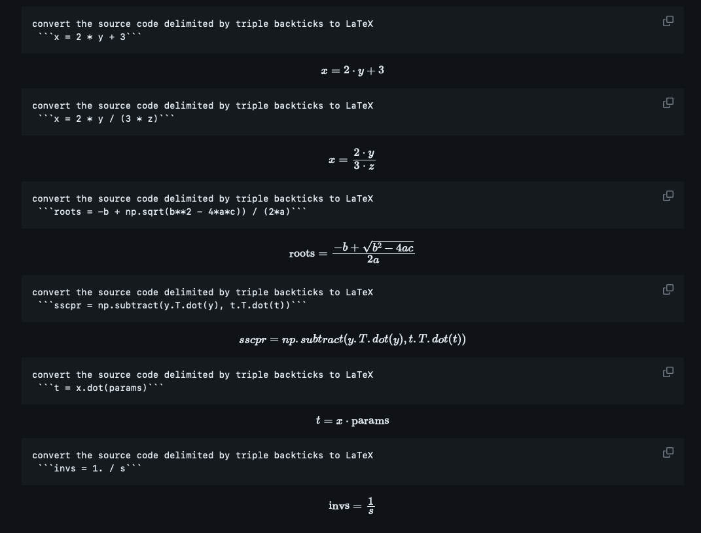

# Examples of generating documentation from code

source for example code: https://github.com/statsmodels/statsmodels/blob/main/statsmodels/multivariate/multivariate_ols.py
Prepared source file by removing all docstrings and comments.

Also generated documentation for this program, `generate_documentation.py`.

## Key source files:
- `generate_documentation.py`: Original program to generate documentation from code.
- `generate_detailed_documentation.py`: Generates detailed documentation from code using Python's `ast` library to extract specific program components, e.g., functions, to feed into the LLM.

## Prompts:
| Prompt                                                                                                                                                              | output file                                                                 |
|---------------------------------------------------------------------------------------------------------------------------------------------------------------------|-----------------------------------------------------------------------------|
| produce a general description of the code and describe what it does                                                                                                 | documentation_dir/documentation1.txt, documentation_dir/documentation1a.txt |
| generate docstring following the PEP guidelines for each method or function.  do not include source code in the output.                                             | documentation_dir/documentation2.txt, documentation_dir/documentation2a.txt |
| generate docstring following the PEP guidelines for each method or function.                                                                                        | documentation_dir/documentation3.txt                                        |
| produce a general description of the code and describe what it does.  output in markdown format. For each function, method or class show as a markdown bullet item. | documentation_dir/documentation4.md                                         |
| "produce a general description of the code and describe what it does.  output in html format. Paragraphs should be delineated by with \<p\> and \</p\> tags.        | documentation_dir/documentation5.html                                       |
| explain the code.                                                                                                                                                   | documentation_dir/documentation6.txt, documentation_dir/documentation7.txt  |
| \<empty string\>                                                                                                                                                    | documentation_dir/documentation8.txt                                        |


## Sample execution

Arguments:
- input source file
- output directory
- --prompt: LLM prompt, default is "produce a general description of the code and describe what it does"

Example execution:
```bash
python generate_documentation.py  source_files/example1.sas generated_documentation

python generate_documentation.py  source_files/example1.sas generated_documentation --prompt "produce docstring for each method or function"  

```

## Observations:
* model gpt-3.5-turbo resulted in this error, to correct used `gpt-3.5-turbo-16k`, which supports 16k tokens.
  ```text
  starting to document multivariate_ols.py...with prompt 'produce a general description of the code and describe what it does'
  Traceback (most recent call last):
    File "/opt/project/codex/generate_documentation/generate_documentation.py", line 53, in <module>
      documentation_text = generate_documentation(prompt, source_file)
    File "/opt/project/codex/generate_documentation/generate_documentation.py", line 19, in generate_documentation
      response = openai.ChatCompletion.create(
    File "/usr/local/lib/python3.9/site-packages/openai/api_resources/chat_completion.py", line 25, in create
      return super().create(*args, **kwargs)
    File "/usr/local/lib/python3.9/site-packages/openai/api_resources/abstract/engine_api_resource.py", line 153, in create
      response, _, api_key = requestor.request(
    File "/usr/local/lib/python3.9/site-packages/openai/api_requestor.py", line 298, in request
      resp, got_stream = self._interpret_response(result, stream)
    File "/usr/local/lib/python3.9/site-packages/openai/api_requestor.py", line 700, in _interpret_response
      self._interpret_response_line(
    File "/usr/local/lib/python3.9/site-packages/openai/api_requestor.py", line 763, in _interpret_response_line
      raise self.handle_error_response(
  openai.error.InvalidRequestError: This model's maximum context length is 4097 tokens. However, you requested 5556 tokens (3508 in the messages, 2048 in the completion). Please reduce the length of the messages or completion.
  ```
* if output exceeds max token length parameter, the output is truncated.  Resolved by increasing the parameter `max_tokens` from 2K to 8K in the `openai.ChatCompletion.create()` call.

* generated documentation `documentation1.txt` file, for the most part, reflects the processing in the module.  Depending on the level of detailed required, there are the missing details:
  * Missing detail for `_multivariate_ols_test`.  The generated documentation does not identify the call to `_multivariate_test(hypotheses, exog_names, endog_names, fn)`, which in turns calls  `multivariate_stats(eigv2, p, q, df_resid)`.  In other words, there is no indication of the nested function calls.
  * Missing documentation for the internal function `_multivariate_test`.
  * Missing detail on call to `patsy.DesignInfo()`

* Generated documentation file `documentation3.txt`.  Depending on requirement, the prompt to generate documentation should prevent copying of original source code.  There is the possibility of dropping code when generating the documentation file.  In this example, the in-line comments are dropped. 

* Generated documentation for program `generate_documentation.py` (file `documentation1a.txt`), for the most part, reflects the processing in the module.  It misses describing a step and incorrectly describes the final step in the module.
  * Missing description of issuing a message at the start of the processing
  * Incorrectly describes the final step as, "the code prints a messaging the start and completion of the documentation process".  The correct description is "the code prints a message for completing the documentation process".

* Generating markdown or html (`documentation4.md` and `documentation5.html`, respectively).  Generates the same text.  Able to take advantage of simple Markdown directives.  However, html output is only raw text.  More resarch is needed in this area.  May need to utilize few shot learning techniques to get right formatting of output.

* add `documenation2a.txt` that generates docstring for function in `generate_documentation.py` program.  Generated docstring is accurate.  However, source code is inlcuded even though prompt specified no source code should be generated.

* addition of doctring content affects documentation generation.  With docstrings, the generated documentation contains less detail.  This may be the result of adding more context that may confuse the LLM.  More research is needed to determine if this applies to all modules or the `multievariate_ols.py` module.

* Used `ChatGPT` to get initial  version of software to extract certain source code elements,i.e., function and class definitions.  prompt used: `example python program to read in another python program and to extract the source code for each function or class`
  ```python
  import ast
  
  def extract_functions_and_classes(file_path):
      with open(file_path, 'r') as file:
          source_code = file.read()
  
      tree = ast.parse(source_code)
  
      functions_and_classes = []
  
      for node in ast.walk(tree):
          if isinstance(node, ast.FunctionDef):
              function_name = node.name
              function_source = ast.get_source_segment(source_code, node)
              functions_and_classes.append((function_name, function_source))
  
          if isinstance(node, ast.ClassDef):
              class_name = node.name
              class_source = ast.get_source_segment(source_code, node)
              functions_and_classes.append((class_name, class_source))
  
      return functions_and_classes
  
  if __name__ == "__main__":
      python_file_path = "path/to/your/python_file.py"
      extracted_functions_and_classes = extract_functions_and_classes(python_file_path)
  
      for name, source in extracted_functions_and_classes:
          print(f"Name: {name}")
          print(f"Source code:\n{source}\n{'=' * 50}")
  
  ```

* Ran across [reference to a plug-in](https://go.swimm.io/code_documentation?utm_term=generate%20documentation%20from%20source%20code&utm_campaign=Search-Generic-NA-Q1Y23&utm_source=adwords&utm_medium=ppc&hsa_acc=6532259166&hsa_cam=19568644920&hsa_grp=144814353589&hsa_ad=656320086155&hsa_src=g&hsa_tgt=kwd-354894782823&hsa_kw=generate%20documentation%20from%20source%20code&hsa_mt=p&hsa_net=adwords&hsa_ver=3&gclid=Cj0KCQjw2eilBhCCARIsAG0Pf8sxPi59Wvak_KSgGOJsM3g3R-iT7j0pchPeWP4pim4aN_ScDHBmWU4aAlWtEALw_wcB) that "generates" documentation in the IDE.  Sparse website.  Seems like early days start-up.

* Not LLM related.  `Sphinx` utility generates html formatted documentation from embedded `docstring` in the code.

* Technically feasible to use LLM to generate LaTex from Python code if the Python code contains only mathematical expressions.  See `latex_conversion_testbed_llm.py` and `documentation_dir/latex_example_llm.md`  However, it is not clear at this time on a way to consistently determine if a Python statement contains only mathematical expressions.  This is a potential area of research.  Also current implementation inovkes the OpenAI once for each Python statement.  This has performance and cost implications. 

* Performance metrics:

| Module                               | Size (KB) | Elapsed Time (sec) | API Calls | Issues During Generation                                                                                                                                                        |
|--------------------------------------|:---------:|:------------------:|:---------:|---------------------------------------------------------------------------------------------------------------------------------------------------------------------------------|
| `multivariate_ols.py`                |    13     |        149         |    34     | None.                                                                                                                                                                           |
| `large_modules/llm.py`               |    31     |        223         |    71     | None.                                                                                                                                                                           |
| `large_modules/image_feature.py`     |    41     |        313         |    92     | None.                                                                                                                                                                           |
| `large_modules/trainer.py`           |    61     |        217         |    61     | Token limit exception when generating module level description and one class level description. Work-around with try-except wrapper.  No issues in generating rest of documentation. |
| `large_modules/sequence_encoders.py` |    95     |        310         |    91     | Token limit exception when generating module level description. Work-around with try-except wrapper.  No issues in generating rest of documentation.                            |
| `large_modules/visualize.py`         |    169    |        587         |    138    | Token limit exception when generating module level description. Work-around with try-except wrapper.  No issues in generating rest of documentation.                            |

  ```text
  d13a3c1aaf2c:python -u /opt/project/codex/generate_documentation/generate_detailed_documentation.py large_modules/sequence_encoders.py documentation_dir/large_module_sequence_encoders.md
  starting to document large_modules/sequence_encoders.py
  Error generating module level documentation: This model's maximum context length is 16385 tokens. However, your messages resulted in 18813 tokens. Please reduce the length of the messages.
  <ast.Import object at 0x7f5bb97a64f0>
  <ast.ImportFrom object at 0x7f5bb97a65b0>
  <ast.Import object at 0x7f5bb97a65e0>
  
  
  738b84ef2ef9:python -u /opt/project/codex/generate_documentation/generate_detailed_documentation.py large_modules/visualize.py documentation_dir/large_module_visualize.md
  starting to document large_modules/visualize.py
  Error generating module level documentation: This model's maximum context length is 16385 tokens. However, your messages resulted in 37728 tokens. Please reduce the length of the messages.
  <ast.Import object at 0x7f6b1ca5fd00>
  <ast.Import object at 0x7f6b1ca5fc40>
  <ast.Import object at 0x7f6
  
  
  f8141bedd994:python -u /opt/project/codex/generate_documentation/generate_detailed_documentation.py large_modules/trainer.py documentation_dir/large_module_trainer.md
  starting to document large_modules/trainer.py
  Error generating module level documentation: This model's maximum context length is 16385 tokens. However, you requested 19266 tokens (11170 in the messages, 8096 in the completion). Please reduce the length of the messages or completion.
  <ast.Expr object at 0x7f86f6e04070>
  <ast.Import object at 0x7f86f6e04100>
  
  <ast.Assign object at 0x7fb06579d9d0>
  <ast.ClassDef object at 0x7fb06579d970>
  Error generating class level documentation: This model's maximum context length is 16385 tokens. However, you requested 18488 tokens (10392 in the messages, 8096 in the completion). Please reduce the length of the messages or completion.
  generating doc for method Trainer.get_schema_cls()
  generating doc for method Trainer.__init__()
  
  ```

* Using this prompt

    ```python
  PROMPT_DESCRIPTION_PREFIX = "Describe the Python "
  PROMPT_FUNCTION_DESCRIPTION_SUFFIX = (
      " delimited by triple backticks, including the purpose of each parameter, and document " 
      "the mathematical operations or procedures it performs.  For the mathematical operations "
      "generate LaTex code that can be used to display the equations in a markdown document."
  )
  ```
  able to function documentation with embedded LaTex with the following results:

  ```text
  \[
  \text{{Wilks' lambda}} = \prod_{i=1}^{n_e} (1 - \text{{eigv2}}_i)
  \]
  ```
  
  added code to replace the LaTex directives strings `\[` and `\]` to `$$` and `$$` respectively to be markdown compliant.
